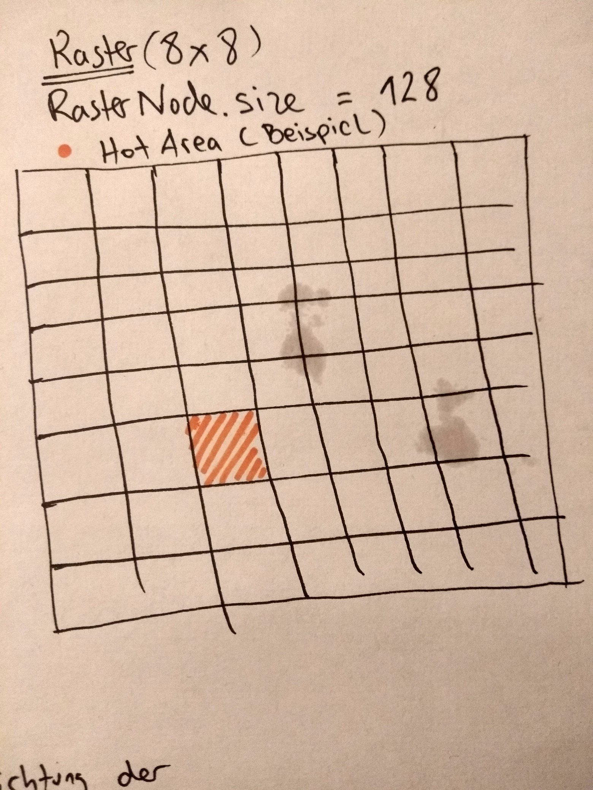
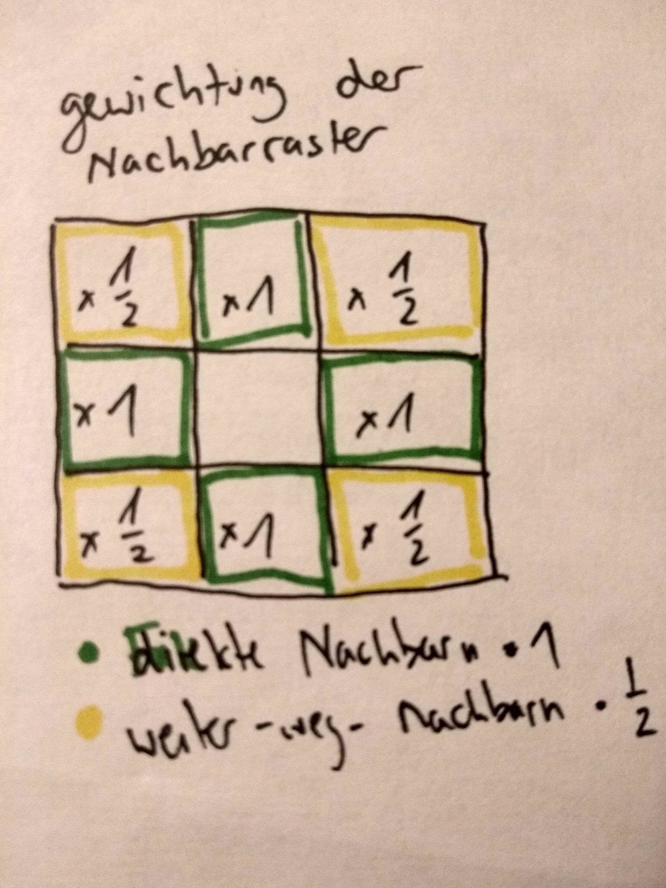
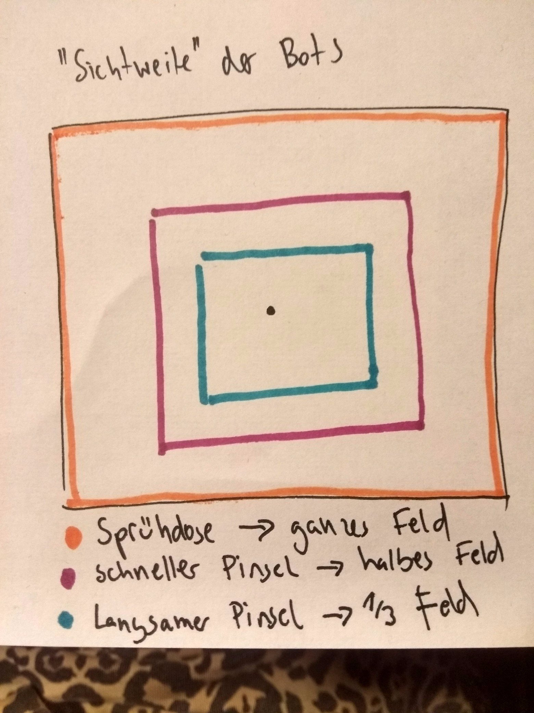
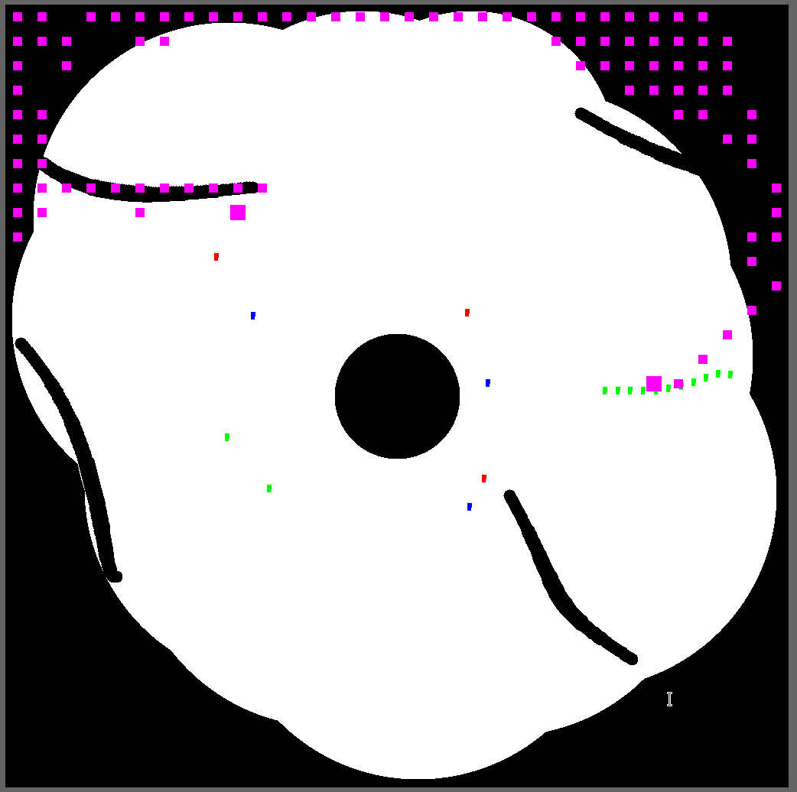

jpeg# Echtzeit-Strategie Spiel
## All Colors Are Beautiful - 1 Projekt von Arne Schlüter & Cat Spangehl
### HTW - IMI - AI for Games


## Strategie
Die drei Pinsel werden gemäß ihren Eigenschaften bestmöglich eingesetzt:

### Alle Pinsel
- Gehen immer auf direktem bzw. schnellstem Wege zum nahegelegensten positiven PowerUp - soweit PowerUps vorhanden sind. (moveToNearestPU())
- Vermeiden das PowerUp *SLOW*
- Decken Möglichst viel gegnerische bzw. weisse Fläche ab (moveToHottestArea())
- Vermeiden Hindernisse (isPathClear())
- Befreien sich aus festgefahrenen Situationen (didNotMove())

### Dose
Weil die Dose keine starke Sprühkraft hat soll sie möglichst nur weisse Flächen besprühen auf denen sie dann trotzdem gut sichtbar ist. Weil sie sehr schnell ist, soll sie dabei gezielt auf dem ganzen Brett nach großen weissen Flächen suchen, und auch auf dem Weg dorthin hauptsächlich weisse Felder besprühen.

- Nutz Dijkstra
- Sucht möglichst weisse Fläche als Ziel
- Sucht sich einen Weg zum Ziel auf dem möglichst viele weisse Felder übermalt werden

### Schmaler Pinsel
Der schmale Pinsel hat eine starke Deckkraft, ist aber trotzdem relativ schnell. Er soll gezielt gegnerische Flächen finden und übermalen. Der Aktionsradius des Pinsels (in dem nach Zielen (=hotAreas) gesucht wird) ist aber nicht das ganze Feld, sondern nur 550 Pixel, damit Ziele in einer sinnvollen Zeit erreicht werden können.

- Nutz Dijkstra
- Sucht Fläche mit viel gegnerischer Farbe als Ziel
- Sucht sich einen Weg zum Ziel auf dem möglichst viel gegnerische Felder übermalt werden

### Breiter Pinsel
Der breite Pinsel ist langsam und kann großflächig streichen. Daher sucht er nur in der näheren Nachbarschaft (400 Pixel Radius) nach Zielen, damit er diese in sinnvoller Zeit erreichen kann.

- Sucht möglichst weiss- und gegnerischfarbige Fläche in näherer Nachbarschaft als Ziel
- Deckt möglichst viel Fläche ab, indem großflächig hin und her gepinselt wird (**paintArea()**)

### Spielfeldrepräsentation (Board, Field)
Das Spielfeld (Board) ist ein zweidimensionales Array von Feldern (**Field** Objekten). Ein Field repräsentiert ein Pixel auf dem Spielfeld. Die Methode initBoard() initialisiert alle Felder mit ihren x-, y-Koordinaten, ihrer Farbe (**getField()**), und ob sie begehbar sind (**isWalkable()**). Die Methode **update(Update update)**, nimmt ein Update Objekt vom Server entgegen und updated das Spielfeld entsprechend der übergebenen Informationen (Bot bewegt, PU spawn, PU cleared).

### Ziel bestimmen - where to go?
Zunächst stellt sich jedem Bot bei der Berechnung eines Zuges die Frage: wo soll ich mich eigentlich hinrichten. Die berechnung des Zieles hängt von verschiedenen Faktoren ab. Grundsätzlich gilt für alle Bots bei der Zugberechnung die Priorisierung:
* Steckst du fest? Ändere die Richtung!
* Gibt es noch positive PowerUps auf dem Feld? Bewege dich zum nächstgelegenen
* Ansonsten berechne die attraktivste Zielarea und bewege dich dort hin
* Alle berechneten Züge werden zusätzlich einem CollisionDetection-Check unterzogen

#### Festgefahren?
Als erstes wird immer geprüft, ob ein Bot sich festgefahren hat, also, ob er sich entweder garnicht bewegt hat, oder, sich zwar bei jedem Schritt bewegt, jedoch insgesamt immer nur in kleinen Kreisen (zB. in einer Ecke). Dafür wird die Differenz zur vorigen Position geprüft, und wie lange schon in der Nachbarschaft herumgeeiert wird (**didNotMove(), checkDidNotMove()**). In diesem Fall wird der Richtungsvektor verändert bevor erneut ein Zug berechnet wird.
#### Power-Ups einsammeln
Sitzt man nicht gerade in eine Ecke fest, haben die höchste Priorität die PowerUps. Kommt über ein Update ein PowerUp (PU) vom Server, wird dieses auf der Spielfeldrepräsentation verzeichnet. Ist es ein positives PowerUp wird es zusätzlich als Objekt PowerUp im Hashset *PowerUps* abgelegt. Wird ein PowerUp wieder eingesammelt wird es aus dem HashSet gelöscht. *PowerUps* beinhaltet also zu jedem Zeitpunkt alle sich auf dem Spiel befindlichen guten PUs.  
Ist *PowerUps* also nicht leer, sucht sich der Bot das ihm nahegelegenste PU aus *PowerUps* und geht auf direktem Wege dorthin (siehe unten: *Direkter Weg*). Ist der direkte Weg durch ein Hindernis versperrt, nutzt er den Dijkstra für den shortest Path (Kantengewichtung = 1, siehe unten: *Dijkstra > Shortest Path*).
#### SLOW vermeiden
Da das PU *SLOW* nicht in *PowerUps* gespeichert wird, versucht ein Bot niemals absichtlich zu diesem PU zu gelangen. Um auch ein versehentliches einsammeln der Uhr zu vermeiden, werden die Pixel des PU-Bereiches (DangerZone!) mit einem boolean **tempBlock** = true versehen. Diese temporäre Blockade wird beim Pathfinding und der CollisionDetection berücksichtigt. Es ist einem Bot so nicht mehr möglich versehentlich die Uhr einzusammeln. Wird das PU von einem anderen Spieler eingesammelt, wird die Blockade wieder aufgehoben.

#### Hot Area finden
Wenn alle PUs eingesammelt sind, geht es daran möglichst sinnvoll das Spielfeld zu bemalen. Dafür sucht man Flächen, die entweder möglichst weiss, oder in gegnerischen Farben bemalt sind - jedenfalls nicht Flächen der eigenen Farbe.

**getHotArea()** berechnet die beste Ziel-Area (RasterNode aus RasterNodes) für den Bot. Es kann eingestellt werden ob dabei die Nachbar-Nodes betrachtet werden sollen oder nicht. Ausserdem (relevant für den Dijkstra mit shortest Path und die Umgehung von Hindernissen), ob nur Ziele berücksichtig werden sollen, die hindernissfrei erreichbar sind.

##### Rastern
Um eine gute Zielfläche (=HotArea) zu bestimmen wird ein Raster über das Board gelegt, und die einzelnen quadratischen Kacheln des Rasters (=RasterNodes - Nodes weil sie später im Dijkstra auch als Nodes dienen), nach den Farben ihrer Pixel gewichtet. Für die Berechnung der HotArea wurde in diesem Spiel-SetUp eine Größen von 128 Pixel Kantenlänge pro RasterNode, also insgesamt 8x8 Kacheln, verwendet.

**getRaster()** berechnet ein Raster mit RasterNodes einstellbarer Größe, und gibt ein Array der Nodes Zurück. (Hier werden auch schon die *weights* der einzelnen Nodes berechnet)



##### Mama, was wiegt eigentlich eine RasterNode?
Für die verschiedene Nutzung der RasterNodes können verschiedene Parameter wichtig sein und eingestellt werde:

* ```private long calcRasterWeight(int startX, int startY, int rasterSize, int weightFactor, int avoidBlackFactor, boolean findWhiteSpace)```
berechnet das Gewicht *weight* für eine einzelne RasterNode. Dabei lässt sich justieren ob gezielt nach weissen (**findWhiteSpace = true**) oder generischen (default) Feldern gesucht werden soll und wie stark diese (weisse bzw gegnerische) gegenüber den anderen und schwarzen gewichtet werden sollen (**weightFactor**). Außerdem gibt es noch eine gewichtung wie stark schwarze Pixel vermieden werden sollen, dies ist v.a. wichtig für den Dijkstra (s.u.).
Dies wird jeweils für jede RasterNode im RasterNodes Array berechnet.

###### Die liebe Nachbarschaft
Für eine RasterNode wird jeweils auch das **leveledNeighbourhoodWeight** berechnet, also wie vorteilhaft die Raster in der Nachbarschaft sind. Dabei werden die direkten Nachbarn höher gewichtet als die Weiter-Weg-Nachbarn (vong Prinzip gaußscher Filter her).



##### Wer ist die hotteste im ganzen Land?
Hot Area wird die RasterNode aus RasterNodes[] mit dem höchsten Gewicht für die eingestellten Parameter. Wenn es zwei gleich gute RasterNodes (e.g. zwei komplett weisse am Anfang) gibt, wird die dem Bot naheliegendste gewählt.

##### Aktionsradius: der Bot schaut bis zum Tellerrand und nicht weiter
Um zu vermeiden, dass zB. ein kriechlamngsamer Breitpinsel sich eine HotArea am anderen Ende des Spielbrettes aussucht, die dann bei seiner potentiellen Ankunft schon garnicht mehr so attraktiv ist, er auf halbem Wege zu einer neuen umgeleitet wird und im schlimmsten Fall überhaupt niemals irgendwo gezielt hinkommt, betrachten die unterschiedlichen Pinsel nur einen ihrer Geschwindigkeit angemessenen Radius auf dem Feld.  

Die flinke Dose, überblickt das ganze Feld, der schmale Pinsel das halbe (einen Radius von 550 Pixel), und der lahme Breite einen Radius von 400 Pixel.



### Pathfinding
Ist geklärt wo man hinwill, bleibt die Frage wie man am besten dort hingelangt. Da gibt es einerseits die Option besonders schnell zu sein (PU!), andererseits die Option einen Weg zu wählen an dem man möglichst viel gute Fläche (= nicht eigene Fläche) übermalt. Und natürlich gilt es Hindernisse zu vermeiden.
#### Direkter Weg
Möchte man schnell irgendwo hin, zb. um ein PU einzusammeln, wählt man, sodenn er frei ist, den direkten Weg (= Luftlinie). Dazu wird zunächst geschaut in welcher Richtung das Ziel liegt, also welcher Bewegungsvektor die Richtung angeben soll (**getDirection**). Dann wird geschaut welche Wegpunkte (Felder/Pixel) auf dem Weg von Startposition A zu Zielpunkt B liegen, und ob eines dieser Felder ein Hindernis darstellt (**isPathClear**).
Die Methode **calcNextField** berechnet dabei das jeweils nächste Feld, für Startposition X und Richtungsvektor Y. Ist der Weg frei, kann er gegangen werden. (Andernfalls kann ein Dijkstra für den kürzesten Weg genutzt werden, s.u.).

#### CollisionDetection
Die CollisionDetection prüft ob auf den nächsten n Schritten in die gewünschte Richtung ein Hindernis kommt. Sie wird für jeden berechneten Zug nochmal gesondert überprüft.

#### Dijkstra
Um statt einfach nur schnell lieber "schlau" zum Ziel zu kommen (i.e. möglichst nicht über die eigene Farbe malen und Hindernisse sinnvoll umfahren), kann man zB. einen Dijkstra Algorithmus nutzen.  

Für die Implementierung des Dijkstra nutzen wir wieder das Raster, genauer: die RasterNodes als Nodes, und das Gewicht (=Farbe) der einzelnen Nodes als Kantengewicht. Anders als bei der HotArea Berechnung haben sie hier allerdings eine kürzere Kantenlänge. Eine RasterNode für den Dijkstra in diesem SetUp (ist auch anders einstellbar, aber hat sich so als sinnvoll erwiesen) ist 16x16 Pixel groß. Die Kantengewichte entsprechen dem Gewicht der Nodes.  

Zur Berechnung eines hindernisfreien Weges gibt es zur Gewichtsberechnung der Nodes den Parameter **avoidBlackFactor()**. Dieser wird bei der Berechnung des Dijkstra (anders als bei der HotArea Berechnung, wo schwarze Pixel nicht so doll ins Gewicht fallen) so hoch gesetzt, dass RasterNodes die schwarze Pixel (=Hindernisse) beinhalten ein so negatives Gewicht haben, dass sie nicht in einem "besten Weg" auftauchen werden.

Der vom Dijkstra errechnete "schlaueste" Weg wird in **my_way** im Bot Objekt gespeichert und abgearbeitet.

##### Weiss und Bunt
Der Dijkstra kann (wie bei der HotArea) darüber gesteuert werden, welches Gewicht die einzelnen Nodes haben. Um zu bestimmen ob ein Bot einen möglichst weissen oder möglicht gegenerischen Weg zu Ziel gehen soll, wird bei der berechnung der Gewichte für die Dijkstra-RasterNodes der Parameter **boolean findWhiteSpace** entsprechend gesetzt. Auch der Gewichtungsfaktor der Farben kann gesondert justieret werden.

##### Kürzester Weg
In der Implementierung für den kürzesten Weg werden alle Kantengewichte statt auf das Gewicht (Farbe) der Nodes auf 1 Gesetzt. So sucht der Dijkstra einfach den kürzesten hindernisfreien Weg zum Ziel.

## Debuggen
Als graphische Hilfe beim Entwickeln dient die DrawPanel Klasse. Diese nutzt die Java Graphics2D API um das aktuelle Board, dessen Elemente (, Hindernisse, Bots, Startposition, ZielNode) und ggf. errechnete Wege (Dijkstras **my_way** Liste von RasterNodes) darzustellen. Die so entstandenen Bilder können als PNG ausgegeben werden und helfen bei der Fehleranalyse.

Hier beispielhaft ein Bild nach dem ersten Versuch den Dijkstra zu implementieren. Es ist deutlich erkennbar, das mit der Gewichtsberechnung etwas nicht stimmt (verkehrte Welt) und der Dijkstra den bestmöglichen schwarzen (=teuersten) Weg berechnet, statt den bestmöglichen Weissen (- das aber effektiv!).




## Klassen
### Main
initialisiert drei Clients und drei Threads
### Client
Objekt Client initialisiert alles was ein Spieler für eine Spielrunde braucht, und stellt die Verbindung zum Server her.
* **startPlayLoop()**
ruft **runClient()** in neuem Thread auf
* **runClient()**
Initialisiert *client, board, powerUps[]* (HashSet), drei *bots*.
Updates *board, powerUps und bots* mit den Updates vom Server (while client.isAlive).
### Board
Ein board ist ein zweidimensionales Array von *fields* (=Pixel) und repräsentiert das komplette Spielfeld (1024x1024). Jedem board wird zudem ein *client* und ein *drawPanwl* zugewiesen.
* **initBoard()** initialisiert alle Felder mit ihren Koordinaten, Farbe (getField()), und ob sie begehbar sind (**isWalkable()**).
* **update()** nimmt ein Update Objekt vom Server entgegen und updated das Spielfeld entsprechend der übergebenen Informationen (Bot bewegt, PU spawn, PU cleared)
* **getBotPos()** kriegt einen Bot übergeben und returned das *field* Objekt an der Position des Bots
* **getHotArea()** berechnet die beste Ziel-Area (RasterNode aus RasterNodes) für den Bot. Es kann eingestellt werden ob dabei die Nachbar-Nodes betrachtet werden sollen oder nicht. Ausserdem (relevant für den Dijkstra mit shortest Path und die Umgehung von Hindernissen), ob nur Ziele berücksichtig werden sollen, die hindernissfrei erreichbar sind.
* **getRasterID()** berechnet rasterID für eine Position x, y
* **getRaster()** berechnet ein Raster mit RasterNodes einstellbarer Größe, und gibt ein Array der Nodes Zurück. (Hier werden auch schon die *weights* der einzelnen Nodes berechnet)
* **calcRasterWeight()** berechnet das Gewicht *weight* für eine einzelne RasterNode.
* **calcWalkableRasterWeight()** berechnet das Gewicht *weight* für eine einzelne RasterNode mit gesonderter (negativer) Wichtung von schwarzen Pixeln -> wichtig für den Dijkstra

### Field
Ein *field* repräsentiert ein Pixel auf dem Spielfeld. Es hat die Eigenschaften Position x und y (im *board*), *color* den Farbwert des Pixels, ob und welcher Bot oder Power-Up sich hier gerade aufhält, ob das *field* walkable ist (Farbwert != 0), oder ein temporärer Block (*tempBlock*) vorliegt (i.e. hier ein aktives PowerUp *SLOW* liegt).
* **setColorFromPlayer()** setzt die Variable *color* in der Farbe des enstprechenden Spielers (Spieler-Info aus Update)
### PowerUp
Power-Up sind Objekte mit den EIgenschaften *type* (*SLOW,BOMB, RAIN*) sowie  Position x, y (in der Spielfeldrepräsentation).
### PowerUps
HashSet mit allen Power-Ups die gegenwärtig auf dem *board* sind.  
* **update(Update update)**
wird ein Update Objekt übergeben. Wenn das Update Objekt Infomationen über ein gespawntes oder eingesammeltes PowerUp enthält wird das HashSet entsprechend ergänzt.  
* **findNearest(Bot bot)**
iteriert über das PowerUps[] und returned den naheliegendsten PowerUp zur aktuellen Position des Bots
* ```get(int x, int y)```  
returned das PowerUp an den Koordinaten x, y aus PowerUps[]
### RasterNode
Objekt RasterNode ist ein einzelnes quadratisches Feld mit Länge n Pixel aus einem Raster was über das Spielbrett gelegt wird. Die Raster werden in der Zielbestimmung verwendet, um die attraktivste Area zu bestimmen und im Pathfinding als Nodes des Dijkstra Graphen.  
RasterNodes haben die Eigenschaften Position **x, y** (der linken oberen Ecke), **size** Kantenlänge des Rasters in Pixel,  **numberID** Position im eindimensionalen Array RasterNodes, **weight** das über eine Heuristik bestimmte Gewicht einer Node (berechnet aus den Farbwerten der fields (=Pixel) in der RasterNode) und **leveledNeighbourhoodWeight** das weight unter Einbeziehung der Nachbarschaft an Rasternodes (näherliegende Nachbarn werden höher gewichtet -> gaußsche Verteilung).
Die Eigenschaften **shortestPath** (LinkedList of RasterNodes), **adjacentRasterNodes** (HashMap of RasterNodes) und **distance** werden zur Berechnung des Dijkstra Pathfinding verwendet.
* **addDestination()** fügt nächstes Ziel zur Berechnung des Dijkstra hinzu
* **addAdjacencyLists()** fügt Nachbarschaftsliste zur Berechnung des Dijkstra hinzu
* **fillHotAreaNeighbourhoodWeight()** berechnet das **leveledNeighbourhoodWeight** für alle RasterNodes in einem Array und weist den Nodes im Array den berechneten Wert für die Eigenschaft zu.
### Bot
Die Bot Klasse enthält die meiste Logik für die Bewegungsabläufe der Bots.
Zunächst kann im Bot festgelegt werden welche kriterien für die Pathfindung erfüllt werden sollen, sprich:
* ob der Bot Dijkstra nutzt oder nicht (**use_dijkstra**)
* wie groß das Raster für die Ziel-Area bestimmung sein soll (**RASTER_SIZE_HOTAREA**)
* wie groß (ggf.) das Raster für die Dijkstra Knoten sein soll (**RASTER_SIZE_DIJKSTRA**)  

Bots haben weiterhin die Eigenschaften **botNo** - um welchen Bot es sich handelt, das aktuelle und letzte Position **pos/old_pos**, den Bewegungsvektor der als Richtung an den Server geschickt wird **move_x/move_y**, einen **radius**, Hilfsvariablen zur berechnung von Fläche malen (**counter, turnsRight, startAreaTurnX/Y**), Hilfvariablen zur Berechnung vom Festfahren (**did_not_move, away_angle, old_cycle**), sowie die RasterNode mit der **hottest_area**, und das Array mit dem gepeicherten Pfad von im Dijkstra errechneten RasterNodes **my_way**.

* ```public void updatePos(Update update, Board board, Client client)```  
updated die Position des Bots in der Spielfeldrepräsentation  
* ```public void move(Board board, Client client, PowerUps powerUps)```  
Ist die Funktion die zur Berechnung eines Zuges aufgerufen wird. Zunächst wird geprüft ob die Position des Bots schon bekannt ist, und ob dieser sich ggf. festgefahren hat (= in einem Loop hängt). In letzterem Fall wird zunächst der Winkel random geändert bevor der neue Zug berechnet wird. Andernfalls, also im Normalfall,  wird der nächste Zug berechnet, und zwar mit Priorisierung zum nächsten positiven PowerUp (falls sich noch eins auf dem Spielfeld befindet), andernfalls auf dem besten/schnellsten (je nach Einstellung) Wege zur attraktivsten Area auf dem Feld.  
* ```private void checkDidNotMove()```
prüft ob der Bot feststeckt (in einem Loop hängt)  
* ```public boolean moveToNearestPU(PowerUps powerUps, Board board)```  
Methode schaut ob das Array aller positiven PowerUps nicht leer ist (= noch PUs auf dem Feld sind), sucht das nahegelegenste und berechnet den schnellsten Weg dorthin. Die Methode gibt einen boolean zurück der in move() abgefragt wird: so lange noch erreichbare positive PowerUps auf dem Feld sind, und sich ein Bot in deren Richtung bewegt, werden Züge nach dieser Methode ausgeführt.  
* ```public boolean moveToHottestArea(Board board)```  
Diese Methode berechnet den besten nächsten Zug um zur hottestArea zu kommen, in Abhängigkeit verschiedener Faktoren (wie weit der Bot "schauen" kann, ob eine hauptsächlich weisse oder gegnerische Fläche gesucht werden soll) und berechnet dann die Richtung die der Bot einschlagen soll. Die Richtung ist abhängig davon, ob der Bot den Dijkstra zum pathfinding nutzt, oder den schnellsten Weg.  
* ```private float[] getDirection(int goalX, int goalY)```  
berechnet den Bewegungsvektor zum nächsten Ziel  
* ``` protected boolean isPathClear(int goalX, int goalY, Board board)```  
schaut ob der Pfad von Punkt a zu einem Zielpunkt b frei von Hindernissen ist. Wird genutzt um zu prüfen ob man einen punkt in Luftlinie erreichen kann ohne auf ein hindernis zu stoßen -> schnellster Weg.  
* ```private boolean collDetect(Board board, float intendedX, float intendedY, long steps)```
prüft ob auf den nächsten n schritten in die gewünschte Richtung ein Hinderniss kommt.  

* ``` private Field calcNextField(Board board, float intentedX, float intendedY, int step) ```
berechnet das nächste Feld für eine Richtung (zB. Luftlinie) zum Ziel X.  
* ```private boolean paintArea(Board board)```  
bewegt den Bot so dass er, immer hin und her, eine Fläche anstreicht. Der Bot streicht immer immer so lange in eine Richtung, bis er an das nächste Hindernis stößt, dreht sich um 90°, streicht 2*radius in diese richtung, und dreht sich wieder um 90° um in die Entgegengesetzte Richtung weiter zu streichen. Beim nächsten Hindernis geschieht das gleiche im entgegengesetzten Winkel (-90°)-
* ```private float[] calcNewDirVector(double angle)```  
berechnet neue Richtungsvektoren anhand eines Winkels der übergeben wird.

### Graph
Hier wird die Logik des Dijkstra-Algorithmus implementiert. Die Grundlage des Algorithmus stammt von [hier](http://www.baeldung.com/java-dijkstra), und wurde für die Verwendung im Projekt mit den RasterNodes angepasst.
### DrawPanel
Dient zum visualisieren des Spielfeldes für Debugging.
